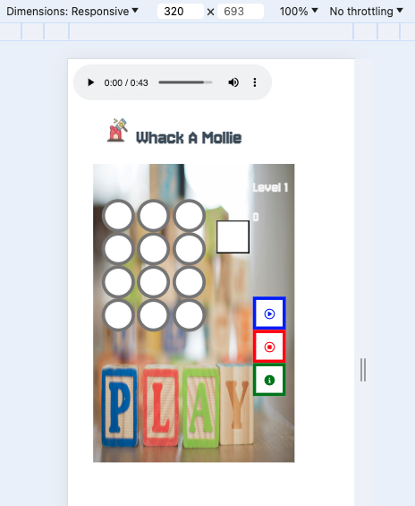
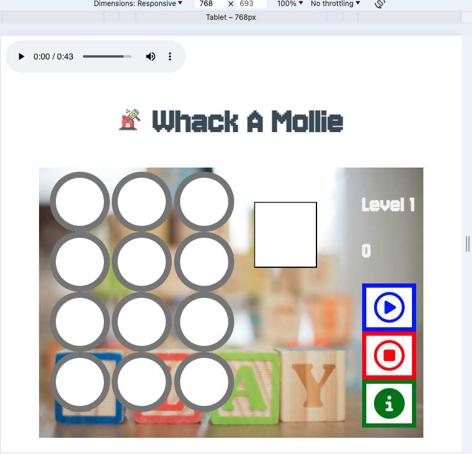

# Introduction
Whack A Mollie is a spin off from the popular arcade game - Whac-A-Mole. Whac-A-Mole was created in 1975 by the amusements manufacturer TOGO in Japan, where it was originally known as Mogura Taiji (モグラ退治, "Mole Buster") or Mogura Tataki (モグラたたき, "Mole Smash").

A typical Whac-A-Mole machine consists of a waist-level cabinet with a play area and display screen, and a large, soft mallet. Five to eight holes in the play area top are filled with small, plastic, cartoonish moles, or other characters, which pop up at random. Points are scored by, as the name suggests, whacking each mole as it appears.

For this version of Whack A Mollie, beside whacking each mole. At random times, a hamburger will appear which require the player to whack it to get extra points. The story of Mollie the mole begins : 

Mollie is a very cheeky mole living in the northern part of England. She loves to pop into the house to steal your food. What you need to do is to hit Mollie when she appears. She also likes to eat your hamburgers. So when the hamburger appears, take it back from Mollie by clicking on it and you will get extra points.  

# Features

In this section, we shows the users what to expect and what features are presented in this game.

**3 Navigation buttons - Play game, Stop game, Info on game.**

Play game - User has to click this red button to start a game.

Stop game - User will click this button when he wants to stop the game or to close the information tab.

Info on game - This is an introduction how to play the game. 

**Game Area - Main Screen**

User is greeted on this main screen when he access the web page. User has 3 options here, that is to play game, stop game or read the information by clicking on the Info (green) button.

**Information**

User clicking on the Info(Green) button will be able to read the introduction of this game.

**Start Game - Hitting the mole**

The rule of the game is to whack the mole when the mole appears. 

**Hitting the Hamburger**

As a bonus, hamburger appears and user will whack it to get extra points.

**Messages prompt**

There are three messages which will be prompted to the user. 
1. At the start, a modal box will appear to guide the user how to navigate the game.
2. Increase in level.
3. Game over.

**Music**

There is a audio control found at the top left corner which allow user to turn on the game music.

# Features left to implement

- To add extra moles for user to hit when they progress on the higher levels.
- A timer to end the game when the user take too long to hit the mole.

# Testing

**Validator Testing**

- HTML
  - No errors were returned when passing through the official [W3C validator](https://validator.w3.org).

  | Link| Result |
  | --- | ---|
  |https://joschanuk.github.io/WhackAMollie/ | No Error |
  

- CSS
  - No errors were found when passing through the official [(Jigsaw) validator](https://jigsaw.w3.org/css-validator/).

- Javascript
  - No erros were found when passing through the offical [JShint](https://jshint.com/).

- Web Page Testing

    | Test | Expectation | How to carry out | Result |
    | ---  | --- | ---| ---|
    | Game Contols button | To either play game, end game or get info on this game | By clicking on the red, blue and green buttons|Pass|
    | Whacking the mole | Mole to appear on the game area and to be able to whack the mole | By clicking | Pass|
    | Whacking the hamburger to get extra points | Hamburger to appear and to be able to whack the hamburger | By clicking on the hamburger | Pass|
    | Audio| The audio is played | Clicking on the play button | Pass|
    | Resizing on different devices | The layout is correct | Using the inspect code | Pass|
    | Deploy Website | Website is working and usable | Deploy from Github| Pass|

- Media Query (Issue encounter)
I noticed that when I use my macbook to align all the buttons and layout of the screen. It is perfect and is at the correct position. But when I moved over the my windows laptop. All the alignments are out. I am documenting this in case when the project is submitted, the alignment are out when the examiner is doing the marking. Attached please see screenshots from macbook.

# Deployment

The site was deployed to GitHub pages. The steps to deploy are as follows:

1. On GitHub, navigate to your site's repository.
2. Under your repository name, click  Settings. If you cannot see the "Settings" tab, select the  dropdown menu, then click Settings.
3. Screenshot of a repository header showing the tabs. The "Settings" tab is highlighted by a dark orange outline.
4. In the "Code and automation" section of the sidebar, click  Pages.
5. Under "Build and deployment", under "Source", select Deploy from a branch.
6. Under "Build and deployment", use the branch dropdown menu and select a publishing source.
Screenshot of Pages settings in a GitHub repository. A menu to select a branch for a publishing source, labeled "None," is outlined in dark orange.
7. Click Save.

Once the master branch has been selected, the page will be automatically refreshed with a detailed ribbon display to indicate the successful deployment.

The live link can be found here - https://joschanuk.github.io/WhackAMollie/

# Credits

**Content and Media**

- The icons in the footer were taken from [Font Awesome](https://fontawesome.com/).
- Source codes from Love Math to build my very own computer game - Whack A Mollie.
- [Wikipedia](https://en.wikipedia.org/wiki/Whac-A-Mole) on what is Whack a mole game.
- [Picabay](https://pixabay.com/sound-effects/search/game/) and [Mixkit](https://mixkit.co/) for the music and sound for this game.
- [W3school](https://www.w3schools.com) - For guiding me how to write the codes and the code for the Modal Box.
- Icons used in this game is provided by [Flaticon](https://www.flaticon.com/).
- Instruction to deploy is taken from [Github](https://docs.github.com/en/pages/getting-started-with-github-pages/configuring-a-publishing-source-for-your-github-pages-site).
