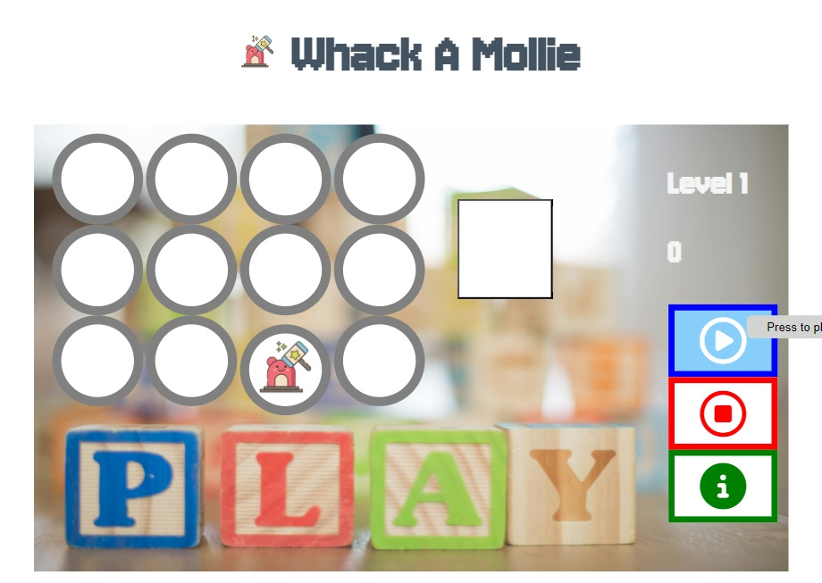

# Introduction
Whack A Mollie is a spin off from the popular arcade game - Whac-A-Mole. Whac-A-Mole was created in 1975 by the amusements manufacturer TOGO in Japan, where it was originally known as Mogura Taiji (モグラ退治, "Mole Buster") or Mogura Tataki (モグラたたき, "Mole Smash").

A typical Whac-A-Mole machine consists of a waist-level cabinet with a play area and display screen, and a large, soft mallet. Five to eight holes in the play area top are filled with small, plastic, cartoonish moles, or other characters, which pop up at random. Points are scored by, as the name suggests, whacking each mole as it appears.

For this version of Whack A Mollie, beside whacking each mole. At random times, a hamburger will appear which require the player to whack it to get extra points. The story of Mollie the mole begins : 

Mollie is a very cheeky mole living in the northern part of England. She loves to pop into the house to steal your food. What you need to do is to hit Mollie when she appears. She also likes to eat your hamburgers. So when the hamburger appears, take it back from Mollie by clicking on it and you will get extra points.  

# Features

In this section, we shows the users what to expect and what features are presented in this game.

**3 Navigation buttons - Play game, Stop game, Info on game.**

Play game - 
Stop game - 
Info on game - 

**Game Area - Main Screen**

**Information**

**Start Game - Hitting the mole**

**Hitting the Hamburger**

**Messages prompt**

# Features left to implement

- To add extra moles for user to hit when they progress on the higher levels.
- A timer to end the game when the user take too long to hit the mole.

# Testing

**Validator Testing**

- HTML
  - No errors were returned when passing through the official [W3C validator](https://validator.w3.org)

  | Link| Result |
  | --- | ---|
  |https://joschanuk.github.io/love-dogs/index.html | No Error |
  |https://joschanuk.github.io/love-dogs/gallery.html | No Error |
  |https://joschanuk.github.io/love-dogs/caring.html | No Error |
  |https://joschanuk.github.io/love-dogs/contact.html | No Error |

- CSS
  - No errors were found when passing through the official [(Jigsaw) validator](https://jigsaw.w3.org/css-validator/)

- Javascript

- Web Page Testing

    | Test | Expectation | How to carry out | Result |
    | ---  | --- | ---| ---|
    | Nav bar | To be able to bring you to another webpage | By clicking on the text|Pass|
    | Dog walk sign up | User details are captured | Enter sign up details | Pass|
    | Social Media | Re direct to the website log in page | Click on the icons | Pass|
    | Audio| The audio is played | Clicking on the play button | Pass|
    | Video | The video is played| Clicking on the Play button| Pass|
    | Map | The Map will be enlarged | Clicking on the map | Pass|
    | Resizing on different devices | The layout is correct | Using the inspect code | Pass|
    | Deploy Website | Website is working and usable | Deploy from Github| Pass|

# Deployment

The site was deployed to GitHub pages. The steps to deploy are as follows:

1. On GitHub, navigate to your site's repository.
2. Under your repository name, click  Settings. If you cannot see the "Settings" tab, select the  dropdown menu, then click Settings.
3. Screenshot of a repository header showing the tabs. The "Settings" tab is highlighted by a dark orange outline.
4. In the "Code and automation" section of the sidebar, click  Pages.
5. Under "Build and deployment", under "Source", select Deploy from a branch.
6. Under "Build and deployment", use the branch dropdown menu and select a publishing source.
Screenshot of Pages settings in a GitHub repository. A menu to select a branch for a publishing source, labeled "None," is outlined in dark orange.
7. Click Save.

Once the master branch has been selected, the page will be automatically refreshed with a detailed ribbon display to indicate the successful deployment.

The live link can be found here - https://joschanuk.github.io/love-dogs/

# Credits

**Content and Media**

- The icons in the footer were taken from [Font Awesome](https://fontawesome.com/).
- Source codes from Love Math to build my very own computer game - Whack A Mollie.
- https://en.wikipedia.org/wiki/Whac-A-Mole.
- Downloaded a mp3 and mp4 (music and video) from Youtube.
- [W3school](https://www.w3schools.com) - For guiding me how to write the codes.
- Text in the caring page is taken from website [Animal Foundation.com](https://animalfoundation.com/whats-going-on/blog/basic-necessities-proper-pet-care).
- All walker's pictures are taken from my personal photo album.
- Instruction to deploy is taken from [Github](https://docs.github.com/en/pages/getting-started-with-github-pages/configuring-a-publishing-source-for-your-github-pages-site).
- Putting google maps using iframe [stackoverflow](https://stackoverflow.com/questions/23737427/how-to-put-two-iframes-side-by-side).
- Pure CSS Hamburger [fold-out menu](https://codepen.io/erikterwan/pen/EVzeRP). 